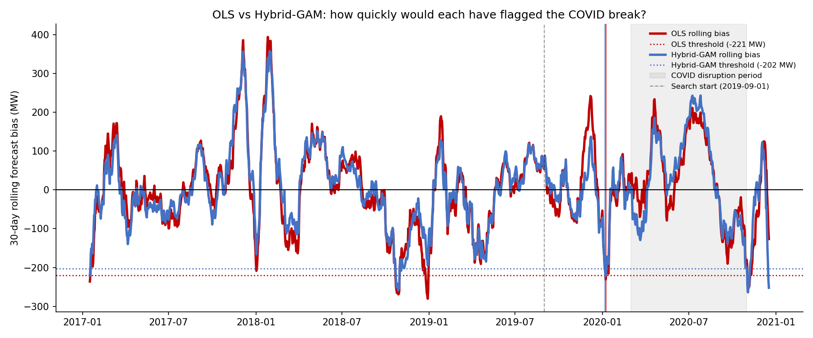

Work

Disciplined where it counts. Curious everywhere else.

A few things I've built recently. Unless noted otherwise, the data
engineering, modelling, and analysis are mine end to end.

Complete
Forecasting (Econometric)
One-Off

<h3 class="project-list-title"><a href="projects/aemo-exogenous-shock.html">Reacting to an Exogenous Shock Mid-Forecast</a></h3>

A demo forecasting model showing how to detect and respond to an exogenous shock partway through a forecast horizon, using AEMO electricity demand data.

Complete
ETL Pipelines
Historical Recipe Series

<h3 class="project-list-title"><a href="projects/chronicling-america.html">Chronicling America API Migration</a></h3>

Migrating a bulk newspaper data pipeline to a new API after the legacy access method was deprecated.

In Progress
Historical Recipe Series
Python

<h3 class="project-list-title"><a href="projects/ocr-assistance-model.html">Training an OCR Assistance Model</a></h3>

A model-in-progress to assist OCR correction on historical newspaper scans, as part of the Historical Recipe Series.

## Latest Articles

A few notes on the work, written as I go.

<h3><a class="stretched-link" href="articles/reflections-on-vibe-coding.html">Reflections on Vibe Coding: Get the Craftsman a Duck that Talks Back</a></h3>

What changed when I pointed AI at a from-scratch build versus a legacy API migration - and what the research says about why.

<h3><a class="stretched-link" href="articles/exogenous-shocks-in-practice.html">Lorem Ipsum Dolor Sit Amet Consectetur</a></h3>

Lorem ipsum dolor sit amet, consectetur adipiscing elit, sed do eiusmod tempor incididunt ut labore.

<a href="articles.html">View all articles &rarr;</a>

