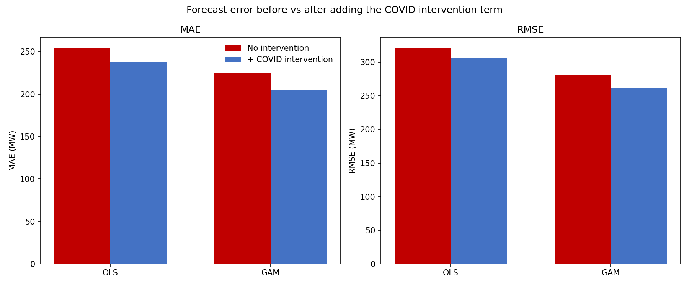

## Overview

Every demand forecast leans on one assumption: that the relationship you fit
on past data still holds across the horizon you're forecasting. COVID-19
broke that assumption for almost everyone. It was a textbook exogenous
shock: it arrived mid-forecast and pulled actual demand away from anything
a pre-2020 model would have predicted.

This is a self-contained demo built on public AEMO operational demand data
for Victoria. It asks one narrow question: when your forecast experiences a
shock mid-flight, will you know something strange is occurring? How? And
how soon?

Spoiler: the shock that first disrupted 2020 energy demand forecasts wasn't
COVID.

Check out the [full notebook on GitHub](https://github.com/GG-makes/AEMO-Demand-Forecasting-Demo/blob/main/vic_covid_demand_analysis_with_glossary.ipynb).

## Method

The setup is small enough to read end to end, but it mirrors how AEMO
predicts and stress-tests medium-to-long term operational demand.

1. **Data.** AEMO operational demand for Victoria, paired with observed weather over the same period, from the beginning of 2017 to the end of 2022. The train set is 2017-2019; the test set is 2020-2022. A true energy demand forecast would draw on more granular time and weather data, plus a bevy of techno-economic variables — this is a bite-sized example dataset.
2. **Two modelling approaches, one question.** An Ordinary Least Squares
   model with a linear temperature response serves as the baseline. OLS
   measures how an outcome — here, energy demand — reacts linearly to a
   set of parameters — time and weather. The alternative is a hybrid
   OLS-GAM: the OLS component still explains time effects linearly, while
   the GAM (Generalized Additive Model) lets temperature have a nonlinear
   relationship with demand, so long as that relationship follows a smooth
   curve. The aim was to separate two things that are easy to conflate — a
   misspecified weather response and a genuine structural shock.
3. **Uncertainty, the way operators use it.** Each model produces POE10 /
   POE50 / POE90 bands — the demand levels exceeded 10%, 50%, and 90% of
   the time — built by resampling historical weather years through the
   fitted model. With a larger training set, this would let you pinpoint
   the probability of exceeding a given demand level, the same way AEMO
   frames its own forecasts.
4. **Detecting the break.** A structural-break test over the demand series
   handles the detection half of the question: if you were watching this
   unfold in real time, when would the data first tell you something had
   changed — and would it tell you *what*?
5. **Accounting for that break.** How do you tell your model that
   something unusual is occurring? The most direct way is to give it that
   information explicitly, as a column that says "Yes, COVID lockdowns are
   happening" or "No, COVID lockdowns are not happening." This Yes/No data
   is integrated into the models as a fixed effect.

## Results

**The first break wasn't COVID.** Run break detection over the series and
the earliest structural break doesn't land in March 2020 — it lands months
earlier, in the Black Summer bushfire window over the 2019-20 summer. The
obvious shock wasn't the first one. It's a useful reminder that "the data
changed" and "the thing I was worried about happened" are different
statements: detection tells you that something shifted, not what.

**The nonlinear fix beat the COVID fix.** Across the three models, adding
an explicit COVID intervention term helped less than simply switching to a
nonlinear temperature response. Much of what looked like a COVID anomaly
under OLS was really the linear model failing to capture the curve of the
temperature-demand relationship at the extremes. Once the GAM handled that,
the leftover "COVID effect" shrank substantially.

Check how much the error bars decrease — the difference between the red
bar and the blue bar is the degree to which accounting for COVID makes the
models better.

The two findings make one practical point: when a shock looks like it's
breaking your forecast, check your functional form before you reach for a
special-case term. The dummy you add to "fix COVID" may be quietly
compensating for a model that was misspecified the whole time.

## Links

- [Full analysis notebook](https://github.com/GG-makes/AEMO-Demand-Forecasting-Demo/blob/main/vic_covid_demand_analysis_with_glossary.ipynb)
- [GitHub repo](https://github.com/GG-makes/AEMO-Demand-Forecasting-Demo)
- [AEMO data source](https://www.aemo.com.au/)
